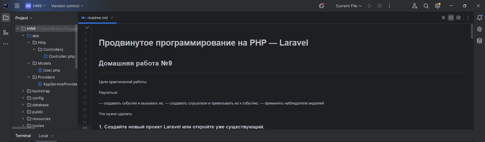
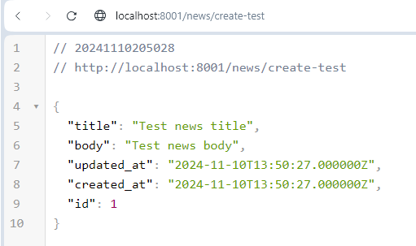
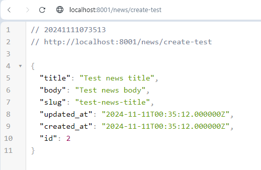

# Продвинутое программирование на PHP — Laravel
## Домашняя работа №9

---

Цели практической работы:

Научиться:

— создавать события и вызывать их;
— создавать слушатели и привязывать их к событию;
— применять наблюдатели моделей.

Что нужно сделать:

### 1. Создайте новый проект Laravel или откройте уже существующий.

---

---

### 2. Создайте новую ветку вашего репозитория от корневой (main или master).

---

---

### 3. Создайте миграцию командой php artisan make:migration CreateNewsTable со следующими полями:

---

---

---

### 4. Создайте модель News.

---

---

### 5. Создайте событие NewsHidden и присвойте полю класса $news параметр $news в конструкторе класса.

---

---

---

### 6. Создайте слушатель NewsHiddenListener, в котором опишите логику слушателя, используя функцию:
   Log::info(‘News ’ . $event->news->id . ‘ hidden’);.

---

---

### 7. Зарегистрируйте событие и слушатель в классе EventServiceProvider.

---

---

### 8. В файле routes/web.php создайте необходимый маршрут ‘/news/create-test’, использующий метод get для создания тестовой новости, и пропишите логику создания тестовой новости.

---

---

---

### 9. В файле routes/web.php создайте необходимый маршрут, использующий метод get ‘/news/{id}/hide’ для скрытия новости. Измените атрибут is_hidden на значение true. После этой операции вызовите событие NewsHidden с помощью инструкции NewsHidden::dispatch($news);.

---

---

---

### 10. В файле storage/logs/laravel.log проверьте, сработал ли слушатель, в нём должна появиться строка ‘News hidden 1’, где 1 — это id скрытой новости (может отличаться).

---

---

### 11. Создайте класс-наблюдатель NewsObserver.

---

---

### 12. Зарегистрируйте его в файле App\Providers\EventServiceProvider в функции boot.

---

---

### 13. Опишите логику изменения поля slug новости при вызове события saving в наблюдателе NewsObserver с помощью инструкции.

---

---

Эта инструкция использует класс Str, который можно подключить с помощью инструкции в начале файла.

---

---

---

### 14. Создайте ещё одну новость с помощью маршрута ‘/news/create-test’.

---

---

### 15. Проверьте заполнение поля slug через базу данных. Оно должно выглядеть следующим образом: «test-news-title» (если вы оставили такое же название, как в примере).

---

---
